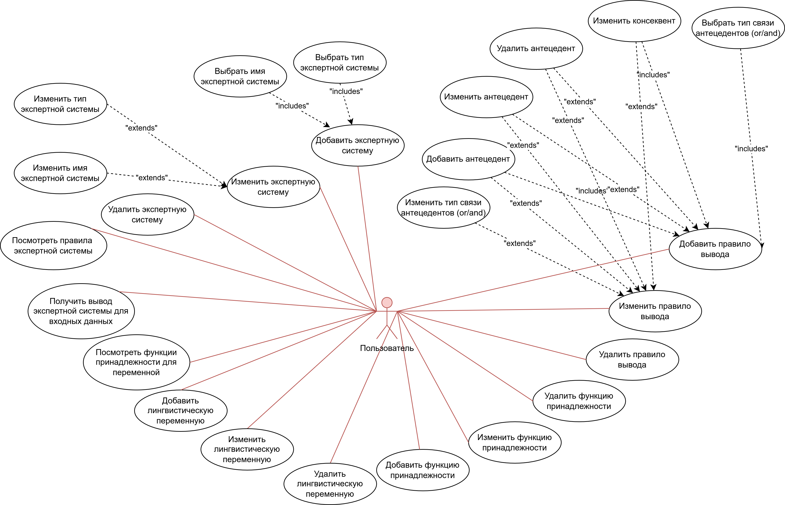

# Основы разработки Web-приложений

## 2.

a. Цель работы: создать приложение для работы с нечеткими экспертными системами.

b. Приложение позволяет работать с нечеткими системами типа Мамдани и Сугено: добавлять/изменять правила, лингвистические переменные, функции принадлежности и получать результат работы нечеткой системы.

c. Use-case диаграмма системы



d. 

e. ER-диаграмма сущностей системы


## Результаты Apache&Benchmark тестирования

### Сервер с балансировкой:

```
This is ApacheBench, Version 2.3 <$Revision: 1843412 $>
Copyright 1996 Adam Twiss, Zeus Technology Ltd, http://www.zeustech.net/
Licensed to The Apache Software Foundation, http://www.apache.org/

Benchmarking localhost (be patient)
Completed 100 requests
Completed 200 requests
Completed 300 requests
Completed 400 requests
Completed 500 requests
Completed 600 requests
Completed 700 requests
Completed 800 requests
Completed 900 requests
Completed 1000 requests
Finished 1000 requests


Server Software:        FuzzyExpertSystemTool
Server Hostname:        localhost
Server Port:            8080

Document Path:          /api/v1/api/systems
Document Length:        109225 bytes

Concurrency Level:      100
Time taken for tests:   4.720 seconds
Complete requests:      1000
Failed requests:        0
Total transferred:      109361000 bytes
HTML transferred:       109225000 bytes
Requests per second:    211.86 [#/sec] (mean)
Time per request:       472.011 [ms] (mean)
Time per request:       4.720 [ms] (mean, across all concurrent requests)
Transfer rate:          22626.12 [Kbytes/sec] received

Connection Times (ms)
              min  mean[+/-sd] median   max
Connect:        0    0   0.6      0       3
Processing:     6  421 392.1    391    1574
Waiting:        5  370 352.9    319    1535
Total:          6  421 392.3    391    1576

Percentage of the requests served within a certain time (ms)
  50%    391
  66%    590
  75%    693
  80%    744
  90%    986
  95%   1164
  98%   1327
  99%   1406
 100%   1576 (longest request)

```

## Сервер без балансировки:

```
This is ApacheBench, Version 2.3 <$Revision: 1843412 $>
Copyright 1996 Adam Twiss, Zeus Technology Ltd, http://www.zeustech.net/
Licensed to The Apache Software Foundation, http://www.apache.org/

Benchmarking localhost (be patient)
Completed 100 requests
Completed 200 requests
Completed 300 requests
Completed 400 requests
Completed 500 requests
Completed 600 requests
Completed 700 requests
Completed 800 requests
Completed 900 requests
Completed 1000 requests
Finished 1000 requests


Server Software:        FuzzyExpertSystemTool
Server Hostname:        localhost
Server Port:            8080

Document Path:          /api/v1/api/systems
Document Length:        109225 bytes

Concurrency Level:      100
Time taken for tests:   2.000 seconds
Complete requests:      1000
Failed requests:        0
Total transferred:      109361000 bytes
HTML transferred:       109225000 bytes
Requests per second:    500.00 [#/sec] (mean)
Time per request:       200.000 [ms] (mean)
Time per request:       2.000 [ms] (mean, across all concurrent requests)
Transfer rate:          53398.95 [Kbytes/sec] received

Connection Times (ms)
              min  mean[+/-sd] median   max
Connect:        0    0   0.7      0       6
Processing:     8  187 101.0    175     655
Waiting:        8  178  97.5    169     635
Total:          8  187 100.9    175     655

Percentage of the requests served within a certain time (ms)
  50%    175
  66%    211
  75%    234
  80%    254
  90%    320
  95%    377
  98%    464
  99%    509
 100%    655 (longest request)

```